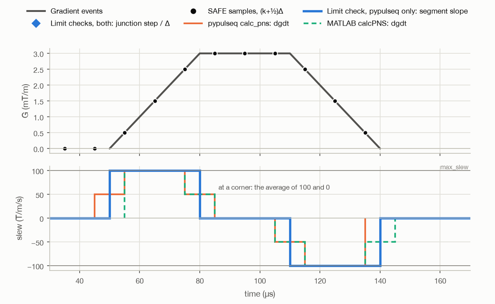
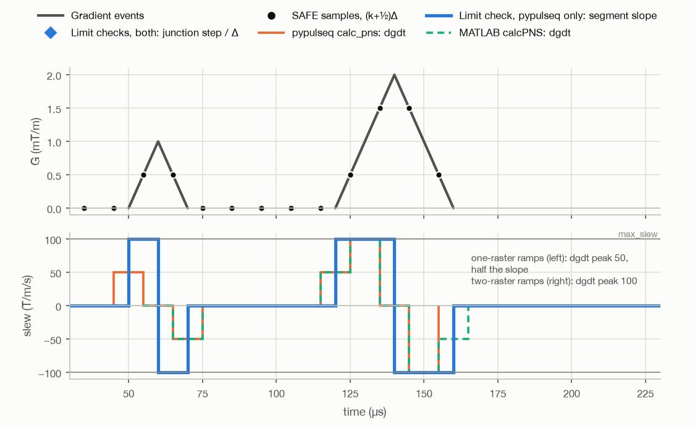
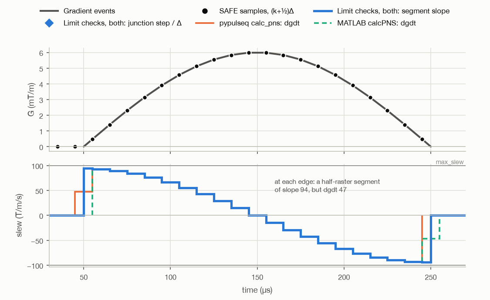
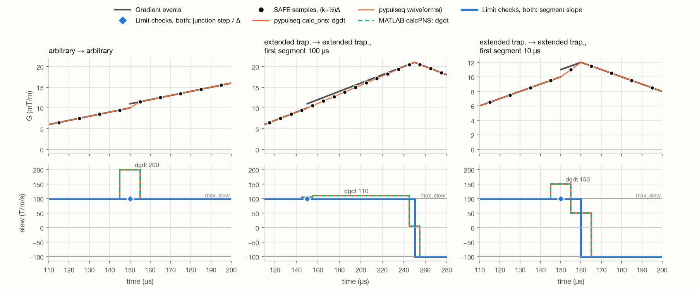
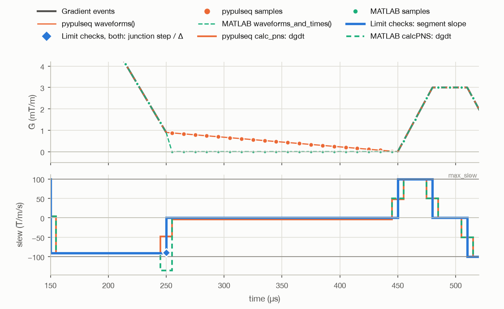
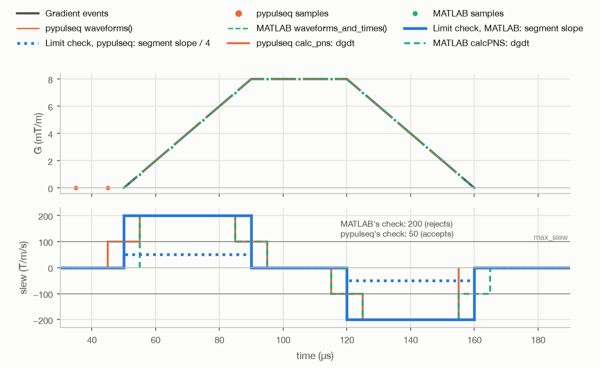
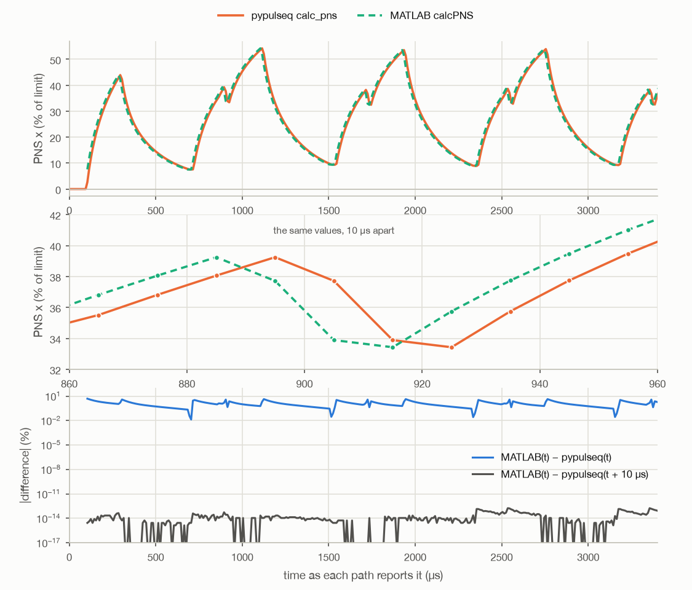

# Gradient slew rate: four paths in pypulseq and MATLAB Pulseq

An analysis (2026-09-24) of the four places where the two Pulseq
implementations compute a gradient slew rate:

|  | pypulseq 1.5.0.post1 | MATLAB Pulseq (`c7469123`, 2026-09-17) |
|---|---|---|
| **Limit checks** | `make_trapezoid`, `make_extended_trapezoid`, `make_arbitrary_grad`, `Sequence.add_block` | `mr.makeTrapezoid`, `mr.makeExtendedTrapezoid`, `mr.makeArbitraryGrad`, `Sequence.setBlock` |
| **PNS** | `Sequence.calculate_pns` → `calc_pns` → SAFE Python port | `Sequence.calcPNS` → SAFE MATLAB toolbox (`safe_pns_prediction`, `0774e805`) |

All numbers and figures come from `slew-definitions/make_figures.py`. It builds
each example with pypulseq and writes it to a `.seq` file. Then pypulseq and
MATLAB Pulseq both read that file. The MATLAB code runs unchanged in GNU Octave
11.3.0, not in MATLAB. The examples use `max_slew` = 100 T/m/s and
`grad_raster_time` Δ = 10 µs, so a step of `max_slew · Δ` is 1 mT/m.
pypulseq master (`f2c582b`, 2026-08-28) has the same slew and PNS code as
1.5.0.post1.

## Summary

1. **There are two definitions of slew, and both implementations use both.**
   - *Limit checks*: the slope of each straight segment of each gradient event,
     and the step at each block junction divided by Δ.
   - *PNS (SAFE)*: `dgdt[k] = (g[k] − g[k−1]) / Δ`, where `g[k]` is the
     gradient sampled at `(k + ½)Δ`. This is the mean slope over one raster
     interval centred on a raster point.
2. **Where the two definitions differ:**
   - At a corner on the raster, `dgdt` is the average of the two slopes.
   - For a ramp one raster interval long (a typical EPI blip), the peak `dgdt`
     is **half** the segment slope (section 2.2).
   - At the edge of an arbitrary gradient, the half-raster edge segment has
     twice the slope that `dgdt` sees (section 2.3).
   - At a block junction with a step, `dgdt` can be larger than `max_slew`,
     although both limit checks accept the step. It reaches **200 T/m/s**
     between two arbitrary gradients, and 110 or 150 T/m/s between two
     extended trapezoids (section 2.4).
   - Without a step, `|dgdt|` is never larger than the largest segment slope.
3. **The two implementations check limits differently.** Of 10 test cases,
   pypulseq and MATLAB give different results in 6 (section 4). pypulseq
   accepts an arbitrary gradient oversampled by a factor of 2 at 350 % of
   `max_slew`, because its check divides by 2Δ where MATLAB's multiplies by 2/Δ
   (section 4.1). MATLAB accepts
   a trapezoid at 200 %, a junction step of 180 %, and a gradient that ends at
   −18 mT/m in the middle of a block.
4. **The two PNS paths give the same values at labels 10 µs apart.** MATLAB
   reports each value one raster earlier than pypulseq does (a forward
   difference against a backward difference). The peaks are equal; the peak
   times differ by 10 µs (section 5). The paths differ in more
   ways:
   - They report different edge samples.
   - They treat a gap after a non-zero gradient end differently. On one
     example, `dgdt` is −136 T/m/s in MATLAB and −48 T/m/s in pypulseq
     (section 2.5), and the PNS differs by 4.5 percentage points.
   - MATLAB `calcPNS` takes only an `.asc` file.
   - With an older `.asc` layout, pypulseq uses a gradient scale of 1/π, not
     the scale in the file.
   - Only MATLAB computes the cardiac (CNS) model.

## 1. The two definitions

### 1.1 Limit checks: the slope of each segment

A gradient event is a polyline. The limit checks compute the slope of each
segment of it:

| Event | Slope | pypulseq | MATLAB |
|---|---|---|---|
| Trapezoid | amplitude / rise time, amplitude / fall time | `make_trapezoid.py:231-239` | **no check** (`makeTrapezoid.m`) |
| Extended trapezoid | `diff(amplitudes) / diff(times)` | `make_extended_trapezoid.py:131-134` | `makeExtendedTrapezoid.m:89-92` |
| Arbitrary gradient | `diff(waveform) / Δ`; the first and last segments are half a raster long, so the slope there is `2 · (waveform[0] − first) / Δ` | `make_arbitrary_grad.py:95-107` | `makeArbitraryGrad.m:70-75` |
| Arbitrary gradient, `oversampling=True` (a sample every Δ/2) | `diff(waveform) / (Δ/2)`, edges included | **`diff / (2Δ)`**, a quarter of the slope (section 4.1) | `makeArbitraryGrad.m:71` |

At a **block junction**, `add_block` (pypulseq) and `setBlock` (MATLAB)
compare the last value of the block before with the first value of the block
after. A step is accepted if it is at most `max_slew · Δ` (1 mT/m here). So a
step counts as a ramp over one raster interval. The check is
`Sequence/block.py:222-294` in pypulseq and `Sequence.m:1066-1135` in MATLAB.

### 1.2 PNS: the SAFE input `dgdt`

Both PNS paths get one polyline for each axis from the whole sequence:
`Sequence.waveforms()` in pypulseq, `waveforms_and_times()` in MATLAB. They
sample it at the centres of the raster intervals, `t_k = (k + ½)Δ`. Then the
SAFE model takes

```
dgdt[k] = (g(t_k) − g(t_{k−1})) / Δ
```

(`safe_gwf_to_pns`: `utils/safe_pns_prediction.py:320` and
`safe_gwf_to_pns.m:36`). Three low-pass filters take `dgdt` as their input.

`dgdt[k]` is the slope of the chord between two samples. It is equal to the
mean of the waveform's slope over the raster interval `[t_{k−1}, t_k]`, which
is centred on the raster point `kΔ`:

```
dgdt[k] = (1/Δ) ∫ g'(t) dt over [t_{k−1}, t_k] = Σ_i s_i · (ℓ_i / Δ)
```

Here `s_i` is the slope of each segment that overlaps the interval and `ℓ_i`
is the length of the overlap. So `dgdt` is a weighted average of the slopes of
the **merged sequence waveform**. `|dgdt|` is never larger than the largest of
those slopes.

The merged waveform is not the same as the event polylines at a block
junction. Both `waveforms()` (`sequence.py:1686-1689`) and
`waveforms_and_times()` (`Sequence.m:2143`) drop the first point of the next
event when it has the same time as the last point of the event before. So the
merged waveform has no vertical step. A step `D` goes into the first segment
of the next event instead. That segment has length `ℓ` and gets the slope
`s + D/ℓ`. This is how `dgdt` can be larger than `max_slew` at a junction
(section 2.4).

## 2. Where the two definitions differ

In the figures, each `dgdt` value is drawn over the raster interval that it
covers, not at the time that its path reports it (that is section 5). The
blue line is the value that the limit checks compare with `max_slew`. For the
events in these figures the two libraries compute the same value, so the
figures draw it one time, with one exception: MATLAB does not check a
trapezoid at all. The legend and the captions say which library checks what.
The one kind of event where the two libraries compute different values is in
section 4.1.

### 2.1 A corner on the raster: the average of the two slopes

<picture>
  <source media="(prefers-color-scheme: dark)" srcset="slew-definitions/fig1-trapezoid-dark.png">
  
</picture>

A trapezoid with ramps three rasters long. `dgdt` is 100 T/m/s inside each
ramp. On the interval around each corner it is 50 T/m/s, the average of 100
and 0. The peaks are equal. Each PNS path leaves out one edge interval (MATLAB
the first, pypulseq the last; section 5). MATLAB does not check the slope of a
trapezoid, so the blue line here is pypulseq's check only.

### 2.2 A ramp of one raster interval: half the slope

<picture>
  <source media="(prefers-color-scheme: dark)" srcset="slew-definitions/fig2-one-raster-ramps-dark.png">
  
</picture>

Both triangles ramp at 100 T/m/s. If a ramp is only one raster interval long,
no SAFE interval lies fully inside it. The interval before it and the interval
after it each see half of it, so `dgdt` peaks at 50 T/m/s. That is half of
what the limit checks see. A ramp two rasters long reaches 100 T/m/s. The y
blips of the `epi` example (1 mT/m, 10 µs ramps) show the same effect: 100
T/m/s for pypulseq's limit check, 50 T/m/s for `dgdt`. `make_trapezoid` gives
a one-raster ramp to every trapezoid of up to `max_slew · Δ` amplitude. As in
section 2.1, MATLAB does not check these trapezoids.

### 2.3 Arbitrary gradients: equal inside, half at the edges

<picture>
  <source media="(prefers-color-scheme: dark)" srcset="slew-definitions/fig3-arbitrary-dark.png">
  
</picture>

The samples of an arbitrary gradient are at `(k + ½)Δ`, the same times as the
SAFE samples. So inside the gradient, `dgdt` is the segment slope. At each
edge the event has a half-raster segment from `first` (or to `last`). Its
slope is twice the change over a full raster interval. The limit checks see
94 T/m/s there, and `dgdt` sees 47 T/m/s.

### 2.4 A step at a block junction: dgdt above max_slew

<picture>
  <source media="(prefers-color-scheme: dark)" srcset="slew-definitions/fig4-junction-steps-dark.png">
  
</picture>

Each example has a step of 1 mT/m (`max_slew · Δ`, the largest that
`add_block` accepts) between two events that ramp at 100 T/m/s. The limit
checks see 100 T/m/s for the segments and 100 T/m/s for the step. `dgdt`
depends on the length `ℓ` of the next event's first segment, which gets the
step (section 1.2):

| Junction | `ℓ` | Merged slope `s + D/ℓ` | Peak `dgdt` |
|---|---|---|---|
| arbitrary → arbitrary | Δ/2 | 300 | **200** = `D/Δ` + the mean of the two slopes |
| extended trapezoid → extended trapezoid | 100 µs | 110 | 110 |
| extended trapezoid → extended trapezoid | 10 µs | 200 | 150 |

Both limit checks accept these junctions. (MATLAB accepts them when the ramps
are just below 100 T/m/s, because it can reject a segment at exactly 100 %;
section 4.) So a sequence that passes the limit checks can have `dgdt` up to
about 2 × `max_slew` at a junction.

### 2.5 A non-zero end before a block with no gradient

<picture>
  <source media="(prefers-color-scheme: dark)" srcset="slew-definitions/fig5-no-gradient-block-dark.png">
  
</picture>

An event ends at 0.9 mT/m, within the tolerance, at the end of its block. The
next block has no gradient on that axis. The limit checks see a step of −0.9
mT/m, that is −90 T/m/s. (The trapezoid at 450 µs is checked by pypulseq
only.) Here the two PNS paths differ, because their merged
waveforms differ in the gap (section 5, item 3): `dgdt` is −48 T/m/s in
pypulseq and −136 T/m/s in MATLAB.

## 3. The numbers

For each example: the largest `|slew|` in T/m/s for each path, and the
peak of the PNS norm with the SAFE example hardware (`safe_example_hw`, not a
real scanner). "Test report" is section 6.

| Example | Axis | pypulseq limit check: segments | MATLAB limit check: segments | Limit checks, both: junctions | pypulseq `dgdt` | MATLAB `dgdt` | pypulseq test report | MATLAB test report | PNS peak pypulseq | PNS peak MATLAB |
|---|---|---|---|---|---|---|---|---|---|---|
| `trap` | x | 100.0 | not checked | 0.0 | 100.0 | 100.0 | 100.0 | 100.0 | 12.683 % | 12.683 % |
| `blips` | x | 100.0 | not checked | 0.0 | 100.0 | 100.0 | 100.0 | 100.0 | 7.909 % | 7.909 % |
| `arb` | x | 94.2 | 94.2 | 0.0 | 93.0 | 93.0 | 94.2 | 94.2 | 17.911 % | 17.911 % |
| `junction_arb` | x | 100.0 | 100.0 | 100.0 | 200.0 | 200.0 | 300.0 | 300.0 | 45.767 % | 45.767 % |
| `junction_ext_long` | x | 100.0 | 100.0 | 100.0 | 110.0 | 110.0 | 110.0 | 110.0 | 46.929 % | 46.929 % |
| `junction_ext_short` | x | 100.0 | 100.0 | 100.0 | 150.0 | 150.0 | 200.0 | 200.0 | 34.461 % | 34.461 % |
| `junction_empty` | x | 100.0 | 100.0 | 90.0 | 100.0 | 135.5 | 100.0 | 180.0 | 30.017 % | 30.017 % |
| `epi` | x | 100.0 | not checked | 0.0 | 100.0 | 100.0 | 100.0 | 100.0 | 54.228 % | 54.228 % |
| `epi` | y | 100.0 | not checked | 0.0 | 50.0 | 50.0 | 100.0 | 100.0 | 54.228 % | 54.228 % |
| `arb_oversampled` | x | 50.0 | 200.0 | 0.0 | 200.0 | 200.0 | 200.0 | 200.0 | 31.651 % | 31.651 % |

"Not checked": `mr.makeTrapezoid` has no slope check, and these examples have
only trapezoids on that axis. The `blips` row shows the peak of both triangles,
so the 100 is from the two-raster triangle. For `arb_oversampled`, the pypulseq
paths use the sequence in memory, not the file (section 4.1). In `junction_empty` the peaks of pypulseq `dgdt` and the
PNS come from other parts of the waveform. The two paths differ at the junction
(section 2.5).

## 4. pypulseq against MATLAB: the limit checks

Each case is built with the `make_*` functions of each implementation and added
with `add_block` / `addBlock`. The events that a case does not test are at 90 %
of `max_slew`.

| Case | pypulseq | MATLAB |
|---|---|---|
| Extended trapezoid, a segment at exactly 100 % (10 mT/m in 100 µs) | accepts | **rejects** (`Slew rate violation (100%)`) |
| Extended trapezoid, a segment at 120 % | rejects | rejects |
| Trapezoid, 20 mT/m with an explicit 100 µs rise time (200 %) | rejects | **accepts** |
| Arbitrary gradient oversampled by 2, segments at 350 % (section 4.1) | **accepts** | rejects |
| Junction step of 1.1 mT/m (110 %): 9 → 10.1 mT/m | rejects | rejects |
| Junction step of 1.8 mT/m (180 %): −0.9 → +0.9 mT/m | rejects | **accepts** |
| An event ends at 9 mT/m, and the next block has no gradient on that axis | rejects | rejects |
| An event ends at −18 mT/m, 100 µs before its block ends | rejects | **accepts** |
| An event ends at +18 mT/m, 100 µs before its block ends | rejects | rejects |
| A label-only block (duration 0) between two joined events | **rejects** | accepts |

The causes, from the source:

- **Exactly 100 %.** pypulseq allows a relative tolerance of 1e-9
  (`max_slew * (1 + eps)`). MATLAB uses a strict `>` with no tolerance, so a
  slope that should be exactly at the limit can fail by one rounding unit.
- **Trapezoid.** `mr.makeTrapezoid` never checks the slope. With an explicit
  `riseTime` it accepts any amplitude up to `maxGrad`. pypulseq checks the
  rise and fall slopes on every path.
- **Oversampled arbitrary gradient.** Oversampled samples are Δ/2 apart.
  MATLAB computes `diff / gradRasterTime * 2` (`makeArbitraryGrad.m:71`),
  which is correct. pypulseq computes `diff / (grad_raster_time * 2)`
  (`make_arbitrary_grad.py:96`), which is 4 × too small. So pypulseq accepts
  slopes up to 4 × `max_slew`. pypulseq master has the same code. See
  section 4.1.
- **Junction step.** MATLAB compares the step only when the next event starts
  above the tolerance (`if abs(cg.start(2)) > ...`, `Sequence.m:1114`). Two
  values each within ±1 mT/m can differ by up to 2 mT/m (200 %). pypulseq
  always compares (`block.py:262`).
- **An event that does not end at 0 before its block ends.** MATLAB tests
  `cg.stop(2) > ...` without `abs` (`Sequence.m:1128`), so it misses a
  negative end. pypulseq uses `abs` (`block.py:291`).
- **A zero-duration block.** MATLAB skips the checks for a block of duration 0
  and compares with the last block that has a duration
  (`Sequence.m:1061`, `:1078`). pypulseq compares with the block just
  before. That block has no gradient, which counts as 0, so pypulseq
  rejects a label-only block between two joined events.

Both implementations check **every axis** at every junction. A block with no
gradient on an axis counts as 0 (pypulseq: the default `check_g` entries,
`block.py:52-56`; MATLAB: `isempty(cg)`, `Sequence.m:1104`).

### 4.1 An oversampled arbitrary gradient

"Oversampled" means `oversampling=True`: oversampling by a factor of 2, the only
factor that either library supports. The gradient has an odd number `n` of
samples, one every `grad_raster_time / 2`, at `t = k · Δ/2` for `k = 1 … n`,
with `first` at `t = 0` and `last` at `t = (n + 1) · Δ/2`, which is its
`shape_dur`. So, unlike an ordinary arbitrary gradient, it has samples on the
raster points as well as between them.

The two test gradients are made with `make_arbitrary_grad(channel, waveform,
first=0, last=0, oversampling=True, system=system)` in pypulseq and
`mr.makeArbitraryGrad(channel, waveform, system, 'oversampling', true, 'first',
0, 'last', 0)` in MATLAB:

- The case in the table above: 17 samples of a triangle, rising by 1.75 mT/m
  per sample to 15.75 mT/m and falling back (350 T/m/s, 350 %; shape_dur
  90 µs). Built with each library.
- The example `arb_oversampled` in the figure below: 21 samples of a trapezoid,
  from 0 to 8 mT/m in 40 µs, 30 µs flat, back to 0 in 40 µs (200 T/m/s, 200 %;
  shape_dur 110 µs). Built with pypulseq only; MATLAB reads the `.seq` file.

<picture>
  <source media="(prefers-color-scheme: dark)" srcset="slew-definitions/fig7-oversampled-dark.png">
  
</picture>

MATLAB's check value is the true slope, 200 T/m/s, so `mr.makeArbitraryGrad`
would reject this gradient. pypulseq's check value is a quarter of it,
50 T/m/s, so `make_arbitrary_grad` accepts it. Both `dgdt` paths see
200 T/m/s: the samples at `(k + ½)Δ` are the odd samples of the gradient.

pypulseq 1.5.0.post1 (and master) also cannot store this gradient in a `.seq`
file and read it back:

- `write()` and `read()` fail in `remove_duplicates` with `KeyError: -1`. The
  time shape ID -1 flags half-raster sampling, and the ID mapping has no entry
  for it (`sequence.py:1167`). With `remove_duplicates=False`, `write()` works,
  and MATLAB reads the file correctly.
- `get_block` gives the gradient twice its `shape_dur` (`block.py:428` has no
  factor ½; MATLAB's `getBlock` has it). So `check_timing` reports
  `BLOCK_DURATION_MISMATCH` for the block, and `read(remove_duplicates=False)`
  gives the same wrong `shape_dur`.
- `waveforms()` treats the gradient as an extended trapezoid and leaves out
  `first` and `last` (`sequence.py:1583-1614`). In this example that changes
  no `dgdt` value, because the SAFE samples fall on the first and last samples.

So for this example the pypulseq paths use the sequence in memory, and the
script takes the end of the gradient from its samples (`tt[-1] + Δ/2`), not
from `get_block`'s `shape_dur`.

## 5. pypulseq against MATLAB: PNS

Both paths use the same SAFE model. The filter is a recursion in MATLAB
(`safe_pns_model.m:76`). In pypulseq it is a convolution with the kernel cut
at 1e-16 (`safe_pns_prediction.py:282-286`). On every example here, the two
give the same PNS values within 3e-15 of the limit, once the time shift below
is corrected.

<picture>
  <source media="(prefers-color-scheme: dark)" srcset="slew-definitions/fig6-pns-time-shift-dark.png">
  
</picture>

The differences:

1. **A time shift of one raster.** `safe_gwf_to_pns` pads the samples and
   returns `dgdt`, which is one sample shorter than its `rf` vector. pypulseq
   keeps the samples with `~isfinite(res.rf[1:])` (`calc_pns.py:84`). So the
   value at `t_k` is from the backward difference `g[k] − g[k−1]`. MATLAB keeps
   `~isfinite(res.rf)` (`calcPNS.m:87`), so the value at `t_k` is from the
   forward difference `g[k+1] − g[k]`. MATLAB's value at `t` equals pypulseq's
   value at `t + 10 µs` (the figure above). The peak values are equal. The
   peak times differ by 10 µs on every example. At the same reported time,
   the values differ by up to 4.9 % of the limit on the `epi` example.
2. **The edges.** pypulseq samples from `Δ/2`. MATLAB samples from the first
   gradient point, rounded down to the raster (`calcPNS.m:45-50`). Because of
   the shift in item 1, MATLAB never reports the first `dgdt` (the rise from
   0 to the first sample), and pypulseq never reports the last one (the fall
   from the last sample to 0). Both are still in the filter state. MATLAB's end
   test uses `ceil(... − eps)` with the machine epsilon (`calcPNS.m:46`). On
   the `epi` example a rounding error in the block start times gave MATLAB one
   extra zero sample at the end. pypulseq uses a 1e-10 s margin
   (`calc_pns.py:49`).
3. **A gap after a non-zero end** (section 2.5). An event can end at a
   non-zero value within the tolerance, here 0.9 mT/m, before a block with no
   gradient on that axis. pypulseq's `waveforms()` has no point in the gap. So
   the waveform goes in a straight line from 0.9 mT/m to the next event,
   200 µs later (−4.5 T/m/s). MATLAB's `waveforms_and_times()` adds a
   ramp to 0 in Δ/2 and gives a warning (`Sequence.m:2114-2119`). That is
   −180 T/m/s. The interval around the junction gets `dgdt` −136 T/m/s in
   MATLAB and −48 T/m/s in pypulseq. The limit checks see a step of −90 T/m/s.
   The PNS of the two paths differs by up to 4.5 percentage points after the
   time shift is corrected.
4. **The hardware input.** MATLAB `calcPNS` calls its local `asc_to_hw(asc, c)`
   for every input (`calcPNS.m:82`). A hardware struct, such as
   `safe_example_hw()`, gives the error `unknown .asc file format`. pypulseq
   accepts a struct or an `.asc` file name. For this reason both paths here
   read one synthetic `.asc` file with the SAFE example values.
5. **The gradient scale of an older `.asc` file.** When the file has no
   `asGPAParameters`, MATLAB reads the scale from `flGCGScaleFactorX/Y/Z`
   (`calcPNS.m:176`). pypulseq ignores those fields and uses 1/π with a
   warning (`asc_to_hw.py:102`). With the example values in the old layout,
   pypulseq's `epi` PNS peak is 0.9095 × the peak with the new layout. MATLAB's
   is 1.0000 ×.
6. **Cardiac stimulation.** When the `.asc` file has a `CarNS` model, MATLAB
   computes the cardiac model as well as the PNS model (`calcPNS.m:70-72`).
   pypulseq's `asc_to_hw` can read that model (`cardiac_model=True`), but
   `calc_pns` never asks for it.
7. **Rotations.** MATLAB's `waveforms_and_times()` applies the rotation
   extension. MATLAB's junction checks compare values in physical
   coordinates. pypulseq 1.5.0.post1 has no rotation extension.

## 6. The test reports: a fifth definition

`Sequence.test_report()` (pypulseq) and `testReport` (MATLAB) give "Max slew
rate" for each axis. Both compute the slope of each segment of the merged
waveform (`ext_test_report.py:158-175`, `testReport.m:335-341`). So they see
the junction steps merged into the next segment: 300, 110 and 200 T/m/s for
the examples of section 2.4. MATLAB also sees its added ramp to 0 in the
example of section 2.5 (180 T/m/s).
MATLAB also calls `mr.restoreAdditionalShapeSamples` to put back the raster-edge
points of a shaped gradient (`Sequence.m:2018`). pypulseq has a TODO for it
(`sequence.py:1591`). This changed no value in these examples. pypulseq's
`test_report()` fails on a sequence with no RF pulse
(`t_excitation[0]`), so the script uses its slew lines directly.

## 7. Open questions and issues found

- **The scanner.** Which definition the Siemens gradient system checks, and on
  which raster, is not known. This note does not answer it.
- **Issues in pypulseq:** the oversampled arbitrary gradient check (4 ×); an
  oversampled arbitrary gradient cannot be written or read (`KeyError: -1`),
  gets twice its `shape_dur` from `get_block`, and loses `first` and `last` in
  `waveforms()` (section 4.1); a zero-duration block in a gradient joint is
  rejected; the 1/π scale for an
  older `.asc` file; `restoreAdditionalShapeSamples` is not ported;
  `test_report()` fails without RF.
- **Issues in MATLAB Pulseq:** no slope check in `makeTrapezoid`; the junction
  check is skipped when the next event starts within the tolerance; the signed
  end check; `calcPNS` rejects a hardware struct; the strict `>` with no
  tolerance.

## 8. How to reproduce

Get the two MATLAB sources at the commits used here:

```bash
git clone https://github.com/pulseq/pulseq.git
git -C pulseq checkout c7469123c2f381f065986e6cc3a7d09730ed16ef
git clone https://github.com/filip-szczepankiewicz/safe_pns_prediction.git
git -C safe_pns_prediction checkout 0774e805ff6df9f81b36bb727519a6e696a4a000
```

Then, from the repository root:

```bash
nix develop --command uv run python docs/notes/slew-definitions/make_figures.py --pulseq-matlab pulseq/matlab --safe-matlab safe_pns_prediction
```

The script uses `octave-cli` from `PATH`, or else runs
`nix shell --inputs-from . nixpkgs#octave`, the Octave of the flake's
locked nixpkgs (a large download the first time). It writes the figures
next to this note and prints the tables of sections 3 and 4. The files:

- `slew_paths.py`: the examples, the pypulseq paths, the synthetic `.asc`.
- `matlab_paths.m`: the MATLAB paths for each example. It checks that its
  copy of the `calcPNS` sampling lines gives the same PNS as `calcPNS`.
- `matlab_limit_cases.m`: the MATLAB side of the table of section 4.
- `make_figures.py`: the figures and the tables.
